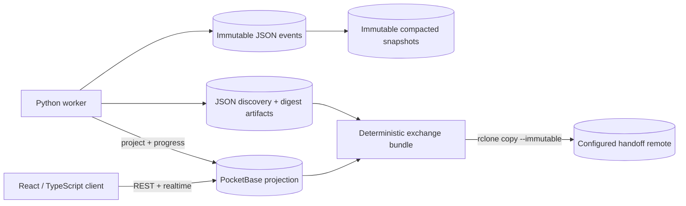
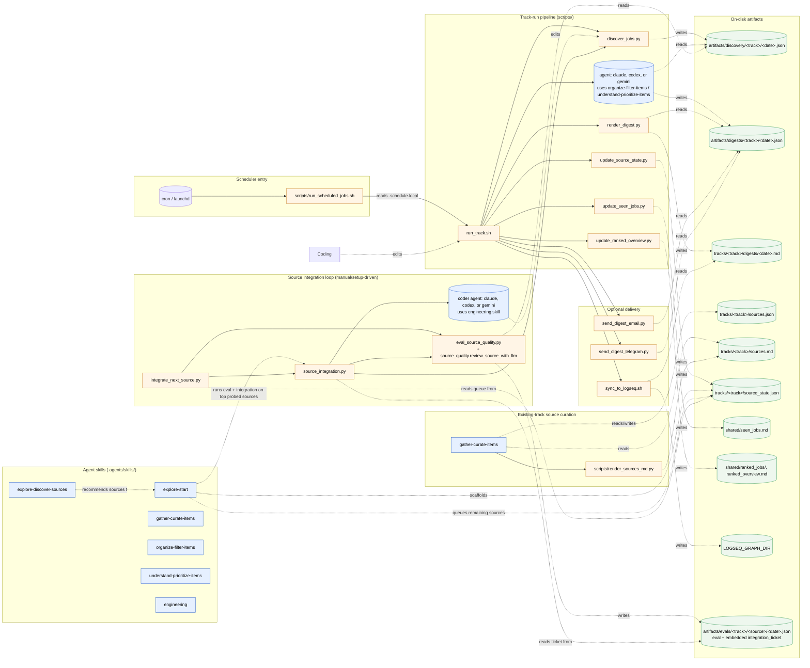
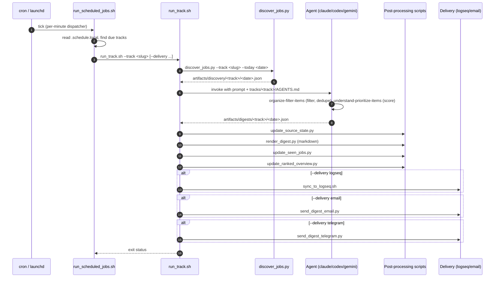
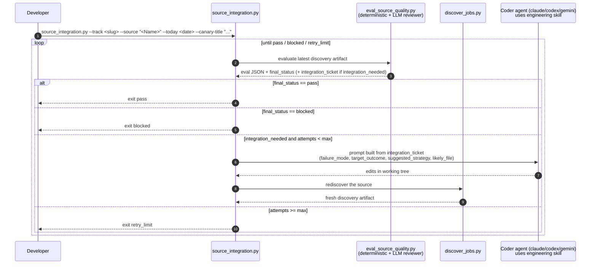

# Architecture Overview

## PocketBase rebuild boundary

An immutable JSON journal and compacted snapshots are the durable record. PocketBase is the operational projection for workspace-scoped queries, authentication, authorization, REST, realtime, and queued operations. Python workers retain deterministic discovery and artifact generation. A React client will talk to PocketBase. Deterministic JSON bundles are the handoff contract and publish through immutable rclone copies. The legacy local portfolio below remains a compatibility surface until frontend and worker parity.

See [`immutable-json-store.md`](./immutable-json-store.md), [`pocketbase.md`](./pocketbase.md), and [`json-handoff.md`](./json-handoff.md).

## Legacy local portfolio management (I9–I14)

The loopback viewer is also a server-rendered local portfolio application. `portfolio_state.py` validates and atomically persists private interests, portfolios, track metadata, and taxonomy overrides. Missing metadata is projected in memory. `serve_html.py` adapts immutable pipeline artifacts into unified `<track>:<item_key>` records and exposes `/api/v1`; `portfolio_operations.py` runs bounded pollable subprocesses with one active operation per track. Non-loopback bindings and static output are read-only. Three tracked starter workflow definitions make `topic_watch`, `market_watch`, and `career_watch` visible on a fresh checkout; `run_starter_workflows.sh` seeds a viewable offline workspace by default or appends their live runs into one workspace with `--live`. See [`local-portfolio.md`](./local-portfolio.md) for the operating guide and API surface.

## Watcher specification boundary

Built-in watcher types are authored under `.arkitype/watchers/<slug>/`. Each directory owns `watcher.json`, `brief.md`, `taxonomy.json`, `sources.json`, and `samples.json`. `scripts/generate_watchers.py` validates cross-references and emits the runtime track metadata, preferences, taxonomy, and source registry. Every emitted file identifies its owning spec. `scripts/test.sh` runs the generator in `--check` mode, so drift and orphaned outputs from renamed or removed specs fail verification instead of becoming a second source of truth. The runtime slug and all artifact paths use the spec directory name; the canonical built-ins are `topic_watch`, `career_watch`, and `market_watch`.

This repo runs agent-assisted observation tracks — AI content, market news, job
postings, or whatever question you scaffold next. Each track combines
deterministic Python helpers under `scripts/` with agent-driven skills under
`.agents/skills/`. This page is the high-level map; for *what the system can do
today* start at [`capabilities.md`](./capabilities.md), for the stage-by-stage
data flow see [`tracks_pipeline.md`](./tracks_pipeline.md), and per-source detail
lives in the auto-generated [`shared/discovery_modes.md`](../shared/discovery_modes.md).

## Work modes

[`AGENTS.md`](../AGENTS.md) routes every prompt to one of five modes:

| Mode | Trigger | Lives in |
| --- | --- | --- |
| Track run | Scheduled or user prompt to run a track and produce a digest | `tracks/<track>/AGENTS.md`, agent skills, `scripts/` |
| Track setup | Prompt to create/scaffold a new search track | `explore-start` skill |
| Existing-track source curation | Prompt to add/evaluate a single named employer or source for an existing track | `gather-curate-items` skill, `tracks/<track>/sources.json`, `scripts/render_sources_md.py` |
| Repo development | Prompt to change code, tests, skills, or docs | `engineering` skill, `scripts/`, `tests/` |
| Non-interactive / harness-launched | Any single-shot automation with no human in the loop | the prompt itself is the contract |

## Component map

The flowchart shows how the agent skills, deterministic scripts, and on-disk artifacts interact across the interactive modes. Solid arrows are direct calls or invocations; dashed arrows are read/write of artifacts.

## Scheduled track run, end to end

The sequence diagram shows what happens for a single scheduled run.

## Source integration loop

New sources should be integrated in layers. First choose the best existing `discovery_mode`; then tune source-specific `search_terms` and native `filters` from the user's CV and preferences; then add provider filter support; only then add dedicated provider parsing or enumeration logic. The source integration loop in `scripts/source_integration.py` automates the coding-and-reevaluation part of that process for one source.

During track setup, the `explore-start` skill probes newly added sources with canaries, tunes config first when results are noisy or too broad, dispatches `source_integration.py` for at most the top 2 sources that still need code, and writes the rest to `tracks/<track>/source_state.json` for one-per-day follow-up via `scripts/integrate_next_source.py`. Outside setup, run `integrate_next_source.py` manually to drain that queue. This loop is not triggered from scheduled track runs.

The reviewer role lives **inside each re-eval cycle**, not as a separate step between attempts. `scripts/eval_source_quality.py` runs a deterministic validator (`source_quality.validate_source_coverage`) and an LLM reviewer (`source_quality.review_source_with_llm`) over the discovery output; if defects remain, the eval emits an `integration_ticket` with a next action such as `config_terms_override`, `config_terms_append`, `config_native_filters`, `provider_filter_support`, or `dedicated_provider_logic`.

### Source integration artifacts

All source-integration-loop output lands under `artifacts/evals/<track>/<source_slug>/`:

- `<date>.json` — eval result with embedded `integration_ticket` (the canonical input to the next coder attempt)
- `<date>.source_integration_loop.json` — summary of the entire loop (phases, attempts, final status)
- `<date>.discovery.json` — fresh discovery artifact captured after a coder attempt
- `<date>.attempt<N>.coder.stdout.jsonl` / `.stderr.log` / `.last_message.txt` — per-attempt coder logs
- `<date>.attempt<N>.postmortem.json` — failure analysis written after a blocked attempt; fed back into the next attempt's prompt as prior context

When an integration lands a working fix, push the branch from your fork and open a PR per [`CONTRIBUTING.md`](../CONTRIBUTING.md) — the loop ends at the working-tree fix; upstreaming is the standard fork-and-PR flow.

## Where to read next

- [`capabilities.md`](./capabilities.md) — what the system can do today, iteration status, known gaps.
- [`local-portfolio.md`](./local-portfolio.md) — starter workflows, dashboard state, APIs, and safety boundaries.
- [`tracks_pipeline.md`](./tracks_pipeline.md) — the six-stage feed pipeline shared by every track.
- [`presentation-kit.md`](./presentation-kit.md) — outline and demo script for presenting the project.
- [`AGENTS.md`](../AGENTS.md) — mode routing rules.
- [`README.md`](../README.md) — user-facing setup, manual runs, scheduling, delivery.
- [`shared/discovery_modes.md`](../shared/discovery_modes.md) — auto-generated catalog of every supported provider.
- [`.knowledge/contributing/adding-sources.md`](./contributing/adding-sources.md) — how to add a new discovery source.
- [`CONTRIBUTING.md`](../CONTRIBUTING.md) — fork-and-PR workflow for code or doc contributions.
- Per-skill instructions live under `.agents/skills/<skill>/SKILL.md` (canonical) and mirror to `.claude/skills/<skill>/SKILL.md` via `bash scripts/sync_claude_skills.sh`.
