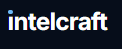
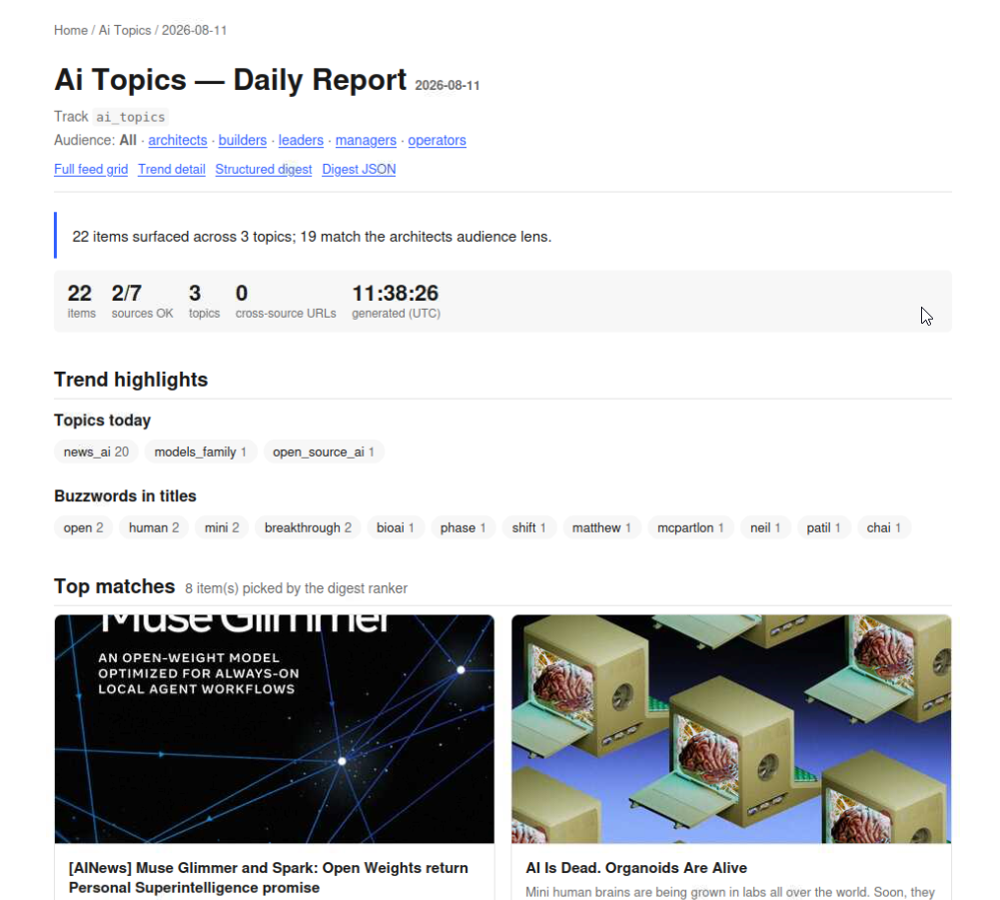

# tekt.observer

**Watch the sources you care about. Get one briefing a day that's actually worth reading.**

Ask tekt.observer a question — *what's happening in AI?*, *what moved my portfolio?*, *who is hiring for AI-enabled engineering?* — and it watches primary sources directly, classifies what it finds against a taxonomy you declare, ranks per audience, and hands you a browsable daily report.

No aggregator deciding what matters. No keyword alerts you learn to ignore.



## Get started

**Run the local app**

```bash
git clone git@github.com:xingh/tekt.observer.git && cd tekt.observer
bash scripts/bootstrap_venv.sh --no-chromium
./tekt.observer up
# open http://127.0.0.1:8091
```

The first launch installs/builds the React frontend when needed, initializes an immutable local JSON journal, and opens a useful workspace with nine realistic signals across `topic_watch`, `job_watch`, and `market_watch`. Save and dismiss actions are journaled and fsynced before the API acknowledges them; automatic snapshots keep replay fast without overwriting history. Node.js 20+ and npm are required for the first frontend build.

**A — agent-driven custom watcher setup**

```bash
git clone git@github.com:xingh/tekt.observer.git && cd tekt.observer && \
  claude "use the explore-start skill in .agents/skills/explore-start to bootstrap this repo and walk me through creating my first track"
```

Swap `claude` for `codex` or `gemini` to use those coding agents instead. The `explore-start` skill authors your profile, scaffolds a track, discovers and validates candidate sources, runs the first digest, and asks about scheduling and delivery.

**B — read the installation guide**

📖 **[`.knowledge/machine_setup.md`](./.knowledge/machine_setup.md)** — bootstrap flow, per-agent notes, secrets handling.

**C — no agent or API keys: populate the starter workspace**

```bash
git clone git@github.com:xingh/tekt.observer.git && cd tekt.observer
bash scripts/bootstrap_venv.sh --no-chromium              # ~30s, one-time
bash scripts/run_starter_workflows.sh --serve             # seed 3 workflows, then serve
# open http://127.0.0.1:8765/
```

The shared portfolio dashboard opens immediately with clearly labeled sample signals for three tracked starter workflows: **Topicwatch · AI in Business**, **Marketwatch · AI Markets & Regulation**, and **Jobwatch · AI-enabled Professions**. When you are ready for current data, rerun with `--live`; that uses the keyless source registries and replaces the sample workspace with a real fetch, classification, ranking, and digest run.

## What every run looks like

Each item is a card with the destination page's OpenGraph image, a topic + content-type + audience badge row, and save / hide / click buttons. Cards are grouped by topic on the report and by publication date in the feed.


Under the hood it's a six-stage deterministic Python pipeline — **discover → enrich → classify → trends → rerank → synthesize → render** — with **no LLM calls** in the daily loop (agents are used where judgment helps: setting up a track and repairing sources). Three shipped tracks — `topic_watch`, `market_watch`, `job_watch` — run this pipeline end-to-end without any API keys.

Those three are built-in watcher types inside tekt.observer, not separate products. Their canonical specs live under `.arkitype/watchers/`; generated runtime slugs and artifact paths are consistently `topic_watch`, `job_watch`, and `market_watch`.

**📸 See more:** [`.knowledge/screenshots.md`](./.knowledge/screenshots.md) — daily report, feed, market-watch top-matches with why-bullets, backfill multitrack landing.

## Read next

| Doc | What's in it |
|---|---|
| 📖 [`.knowledge/machine_setup.md`](./.knowledge/machine_setup.md) | **Installation guide** — first-time setup, bootstrap flow, per-agent notes |
| 📸 [`.knowledge/screenshots.md`](./.knowledge/screenshots.md) | Screenshot gallery for report, feed, trends, backfill multitrack landing |
| 🧭 [`.knowledge/capabilities.md`](./.knowledge/capabilities.md) | What it can do today — capability matrix, iteration status, honest gaps |
| 🔧 [`.knowledge/tracks_pipeline.md`](./.knowledge/tracks_pipeline.md) | The six-stage pipeline script by script, artifacts, backfill mode |
| 🎬 [`.knowledge/presentation-kit.md`](./.knowledge/presentation-kit.md) | Slide outline + demo script for presenting tekt.observer |
| 🏗️ [`.knowledge/architecture.md`](./.knowledge/architecture.md) | Component map + scheduled-run sequence + source-integration loop |
| 🖥️ [`.knowledge/local-portfolio.md`](./.knowledge/local-portfolio.md) | Local dashboard, starter workflows, state files, APIs, and safety model |
| 🗂️ [`shared/discovery_modes.md`](./shared/discovery_modes.md) | Generated catalog of all 60 discovery-mode adapters |
| 🛣️ [`.knowledge/roadmap.md`](./.knowledge/roadmap.md) | What's queued next |
| 🤝 [`CONTRIBUTING.md`](./CONTRIBUTING.md) | Fork-and-PR workflow |

---

<details>
<summary><strong>What it can do today</strong> — capability bullets</summary>

- **Watch sources directly** — 60 discovery-mode adapters for career pages and job APIs, plus a keyless reader for RSS, Atom, and Hacker News.
- **Classify against your taxonomy** — topics, content types, audiences, and per-track extras like watchlist matches or role seniority.
- **Spot trends** — day-over-day velocity, cross-source stories, keyword clouds.
- **Rank per audience** — one pass scores every item for every audience your track declares.
- **Explain itself** — a browsable report, a social-style feed, trend charts, and the raw JSON behind all of it.
- **Learn from you** — save/hide/click events feed back into the next run's ranking.
- **Deliver and schedule** — email, Telegram, or Logseq, daily/weekly/monthly, per track.
- **Heal its own sources** — when a source breaks, an eval agent writes a ticket and a coding agent fixes the adapter.

Full capability tour → [`.knowledge/capabilities.md`](./.knowledge/capabilities.md).
</details>

<details>
<summary><strong>Try the three shipped starter workflows</strong></summary>

```bash
bash scripts/bootstrap_venv.sh --no-chromium

# Recommended: populate one cross-track dashboard with sample signals
bash scripts/run_starter_workflows.sh --serve

# Replace the samples with current data from the keyless live feeds
bash scripts/run_starter_workflows.sh --live --serve

# Or run one workflow into its own scratch workspace
bash scripts/run_pipeline.sh --track topic_watch    --live
bash scripts/run_pipeline.sh --track market_watch --live
bash scripts/run_pipeline.sh --track job_watch    --live

# Deterministic no-network fixture validation remains available separately
bash scripts/test_track_workflow.sh
```

Each run writes into `tests/tmp/<track>/`, mirroring `scripts/test_track_workflow.sh` so your tracked working tree stays clean.

- **`topic_watch`** — Topicwatch for enterprise adoption, workflow productivity, governance, and customer operations
- **`market_watch`** — Marketwatch for AI-exposed public companies, semiconductors, regulation, and policy
- **`job_watch`** — Jobwatch for technical and business professions building, governing, selling, teaching, or operationalizing AI
</details>

<details>
<summary><strong>Review each step + view the result</strong></summary>

Every stage writes to a predictable path:

```
tests/tmp/<track>/artifacts/discovery/<track>/<date>.json         # 1. gather
tests/tmp/<track>/artifacts/enrichment/<track>/urls.json          # 2. enrich (cached across runs)
tests/tmp/<track>/artifacts/organized/<track>/<date>.json         # 3. classify
tests/tmp/<track>/artifacts/trends/<track>/<date>.json            # 4. trends
tests/tmp/<track>/artifacts/ranked_audience/<track>/*/<date>.json # 5. rerank (per audience)
tests/tmp/<track>/artifacts/digests/<track>/<date>.json           # 6. synthesize (default)
tests/tmp/<track>/artifacts/digests/<track>/*/<date>.json         # 6. synthesize (per audience, I7)
tests/tmp/<track>/tracks/<track>/digests/<date>.md                # 6. rendered markdown
```

Two ways to see the output:

```bash
# Live viewer (loopback only, defaults to 127.0.0.1:8765)
./.venv/bin/python scripts/serve_html.py --root tests/tmp/topic_watch

# Publishable static site
./.venv/bin/python scripts/render_html.py --root tests/tmp/topic_watch --out site/
```

Live-server routes:
- `/` — named-portfolio dashboard and cross-track signal inbox
- `/manage` — live runs, source validation, schedules, and operation status
- `/api/v1/state`, `/api/v1/items` — portfolio state and unified items
- `/api/v1/portfolios`, `/api/v1/interests`, `/api/v1/tracks/<track>` — management APIs
- `/api/v1/operations` — pollable local operations
- `/track/<track>/<date>` — consolidated daily report
- `/track/<track>/<date>?audience=<id>` — same report scoped to an audience
- `/track/<track>/feed/<date>` — social-feed grid with OG images
- `/track/<track>/trends/<date>` — trend charts + keyword cloud
- `/track/<track>/<date>/details` — structured digest tables
- `/track/<track>/sources` — sources + persona
- `/raw/digests/<track>/<date>.json` — raw digest JSON

Initialize explicit private portfolio files with `./.venv/bin/python scripts/portfolio_state.py init`. Without initialization, the three starters and any private tracks appear in an implicit **All Tracks** portfolio and no existing files are rewritten. Writes are loopback-only and require same-origin JSON plus the server CSRF token; static exports contain no controls. See [`.knowledge/local-portfolio.md`](./.knowledge/local-portfolio.md) for the state model and API examples.

**Audience switching** — audience list per watcher (from `.arkitype/watchers/*/taxonomy.json`):
- topic_watch: `builders · operators · managers · architects · leaders`
- market_watch: `investors · portfolio_managers · allocators · gps · lps`
- job_watch: `individual_contributor · senior_ic · tech_lead · manager · instructor`
</details>

<details>
<summary><strong>The feedback loop</strong></summary>

Every card in the report and feed carries **save**, **hide**, and **click** buttons. On the live server each click appends one JSON line to `artifacts/feedback/<track>/<audience>/events.jsonl`. On the next run, `track_rerank.py --with-feedback` turns those events into per-item boosts (`save +0.20`, `note +0.10`, `click +0.05`, `hide −0.35`) applied to the audience score — so the thing you saved today ranks higher tomorrow.

Full detail: [`.knowledge/tracks_pipeline.md#feedback-loop-i8`](./.knowledge/tracks_pipeline.md#feedback-loop-i8).
</details>

<details>
<summary><strong>Backfill mode — a month at a time</strong></summary>

`scripts/run_pipeline.sh` covers today. For a range of past dates — demos, month-in-review reports, or seeding a scratch tree with history before daily runs start — use `scripts/backfill.sh` and then render as a single per-day-folder site:

```bash
# 1) fetch + process a date range for each track (parallel across tracks).
#    Use past-or-present dates only — the guard in backfill.sh skips future dates.
DATES=$(for i in $(seq 13 -1 0); do date -u -d "$i days ago" +%F; done)   # last 14 UTC days
bash scripts/backfill.sh --track topic_watch    --dates "$DATES" &
bash scripts/backfill.sh --track market_watch --dates "$DATES" &
bash scripts/backfill.sh --track job_watch    --dates "$DATES" &
wait

# 2) render one publishable folder with 3 tracks × N days
./.venv/bin/python scripts/render_multitrack_site.py \
  --track topic_watch --track market_watch --track job_watch \
  --out /path/to/output/
```

Historical windows apply server-side to HN Algolia sources (real per-date results for the whole history) and client-side to RSS/Atom via `pubDate` (most non-HN feeds only carry their latest window, so older dates naturally get thinner).

Full walk-through: [`.knowledge/tracks_pipeline.md#backfill-mode`](./.knowledge/tracks_pipeline.md#backfill-mode).
</details>

<details>
<summary><strong>Why use it? / Who is it for?</strong></summary>

**Why:**
- See it earlier — watch primary sources (company career pages, central-bank press rooms, arXiv, Hacker News) instead of waiting for an aggregator.
- Better matching — items classified against a taxonomy you declare and scored against your profile + preferences, not just keyword-matched.
- One briefing, not a firehose — a concise digest per audience, by email, Telegram, Logseq, Markdown, or a browsable site.
- Gets better as you use it — save/hide/click feedback changes tomorrow's ranking.
- Cheap and reproducible — the daily loop is deterministic Python with no LLM calls.

**A good fit if you:**
- are comfortable using the command line
- want more control than standard alerts and newsletters provide
- have a recurring question worth watching sources for, daily or weekly

**Probably not a fit if you:**
- do not want to use a CLI tool
- are on Windows (macOS and most Linux distributions are supported)

The three example tracks run without any agent CLI or API key. A supported coding-agent CLI (Claude Code, Codex, or Gemini) is only needed for agent-assisted track setup, source integration, and LLM-written digests.
</details>

<details>
<summary><strong>How it fits — Tekt and SignalFlow</strong></summary>

tekt.observer is the observation half of a larger toolkit. It extends the original jobwatch work by Jonas van der Heyden and integrates it with an AI Fleet Management practice called **SignalFlow** — a way of coordinating a series of steps so a fleet of agents can pursue a goal that's useful to people.

**tekt** is the core tooling engine. It installs the agents you want to use — Claude Desktop/Cowork and Claude Code; Codex CLI and ChatGPT Codex/App (coming soon); OpenClaw, Hermes Agent, ZeroClaw, NanoClaw; VS Code and Zed — and sets up S3-backed communication so instances of Tekt can sync with each other or with anyone else sharing the same buckets.

**tekt.signalflow** is the prompt set that drives an AI fleet through six phases. tekt.observer implements them:

| Phase | What it means | In this repo |
|---|---|---|
| explore | understand a new source and generate a script to crawl it | `explore-discover-sources` skill, source probing |
| seek | run that script against known sources | `scripts/discover_jobs.py`, provider adapters |
| gather | schedule the fetching and collect it in one place | `scripts/feed_gather.py`, the scheduler |
| organize | classify, categorize, annotate, relate, index | `scripts/<track>_classify.py`, `track_trends.py` |
| understand | rerank against a profile, prioritize for impact | `scripts/track_rerank.py` |
| generate | produce a digest and a brief on how to act on it | `synthesize_audience_digests.py`, `render_digest.py`, `render_html.py` |
</details>

<details>
<summary><strong>Your own track — full setup guide</strong></summary>

Follow this when you want your **own** track: your sources, your profile, your schedule, delivered where you read things. (To just try the shipped tracks, the 60-second Option C above is enough.)

Setup is agent-assisted: a guided agent interviews you, scaffolds the track, finds and validates candidate sources, and runs your first digest. Scheduled automation supports Codex CLI, Claude Code CLI, and Gemini CLI.

Full flow lives in [`.knowledge/machine_setup.md`](./.knowledge/machine_setup.md). Short version:

1. **Requirements:** Python 3; Codex CLI, Claude Code CLI, or Gemini CLI; agent logged in; on Linux with Codex, `bwrap` for sandboxing.
2. **Bootstrap:** `bash scripts/bootstrap_machine.sh --agent {claude,codex,gemini}`.
3. **Ubuntu + Codex + bwrap only:** `sudo bash scripts/install_bwrap_apparmor.sh`.
4. **Guided setup:** `bash scripts/start_setup_agent.sh --agent {claude,codex,gemini}` — fills profile, creates track files, discovers and validates sources, runs your first digest, asks about scheduling and delivery.
5. **Manual runs:** `bash scripts/run_track.sh --track <slug> [--delivery logseq|email|telegram]`.

Track-specific preferences live in `tracks/<slug>/prefs.md`. Machine-local config lives in `.env.local` (gitignored). Secrets are read from `JOB_AGENT_SECRETS_FILE` outside the repo.
</details>

<details>
<summary><strong>Agent provider, delivery, scheduling</strong> — reference</summary>

**Provider selection** is written to `.env.local` by setup:

```bash
export JOB_AGENT_PROVIDER=claude   # or codex, or gemini
export JOB_AGENT_BIN=/absolute/path/to/agent
```

`scripts/setup_machine.sh --agent <name>` writes both when the CLI is discoverable on `PATH`.

**Delivery targets** are opt-in per run:

```bash
bash scripts/run_track.sh --track <slug> --delivery logseq
bash scripts/run_track.sh --track <slug> --delivery email
bash scripts/run_track.sh --track <slug> --delivery telegram
```

**Email** — preview with `scripts/send_digest_email.py --dry-run`; SMTP config in `.env.local`, real password behind `JOB_AGENT_SMTP_PASSWORD_CMD` or in `JOB_AGENT_SECRETS_FILE`. Presets: Gmail, Fastmail, Outlook/Hotmail, Proton business SMTP.

**Telegram** — preview with `scripts/send_digest_telegram.py --dry-run`; bot token in `JOB_AGENT_TELEGRAM_BOT_TOKEN_CMD` or `JOB_AGENT_SECRETS_FILE`; chat id in `.env.local`.

**Logseq** — set `LOGSEQ_GRAPH_DIR` in `.env.local`, then `run_track.sh --delivery logseq`.

**Scheduling** — one line per track via `scripts/configure_schedule.py`; installed with `bash scripts/install_scheduler.sh`. Cadence: `daily HH:MM`, `weekly <weekday> HH:MM`, `monthly <day> HH:MM`. Linux uses a checkout-specific per-minute cron dispatcher; macOS uses a LaunchAgent.
</details>

<details>
<summary><strong>Development checks</strong></summary>

```bash
bash scripts/test.sh
```

Runs bash syntax checks, py_compile on every script, `render_discovery_modes_md.py --check`, and the full pytest suite (unit + contract + integration + e2e).
</details>
