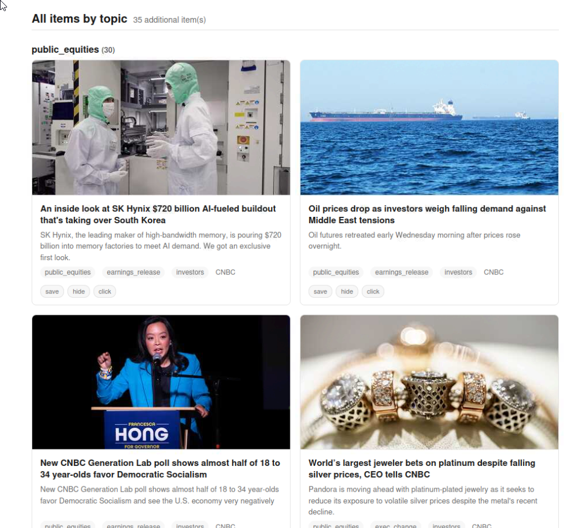
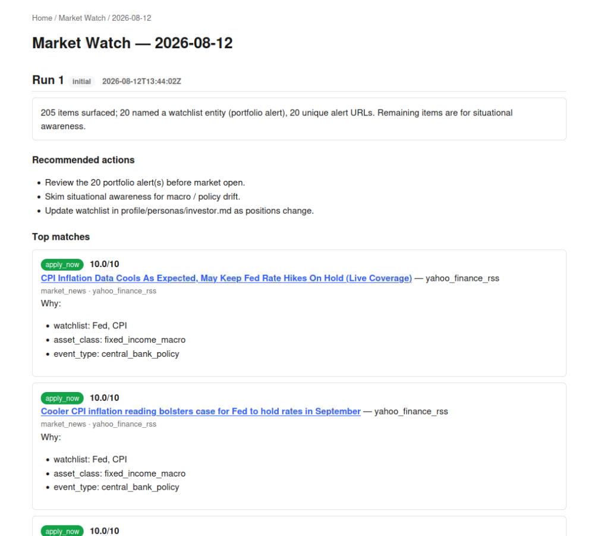
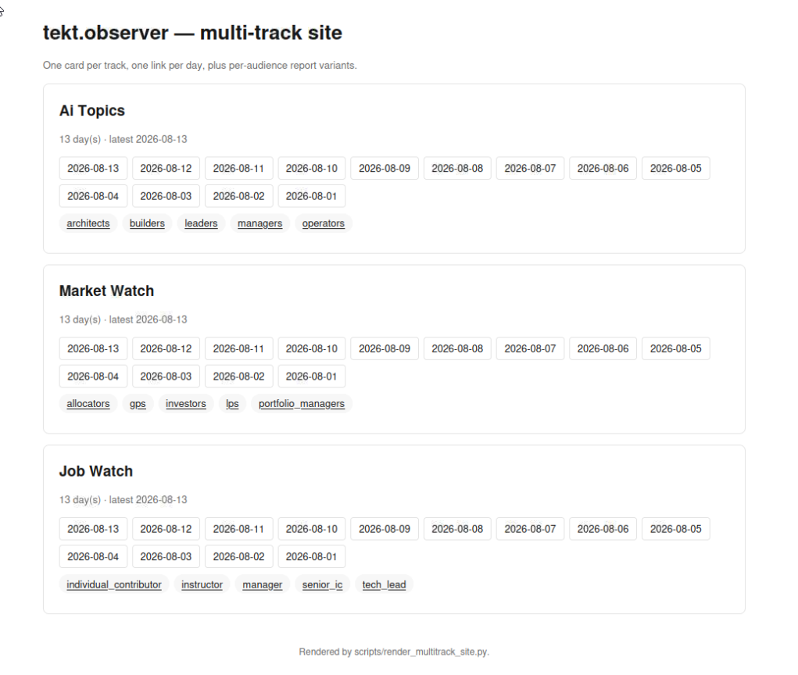

# Screenshots

Every screenshot below is a real page from a real run against real feeds.
Nothing is mocked. See [`docs/tracks_pipeline.md`](./tracks_pipeline.md)
for how each page is produced, and [`README.md`](../README.md) for the
copy-paste commands to reproduce them locally.

## Daily report — the landing page

The consolidated report is the page most people will open first: hero,
executive summary, stats strip (items · sources OK · topics · cross-source
URLs), trend highlights (topic pills, buzzword pills), then top matches
followed by everything else grouped by topic.

## Feed grid — social-style, with OpenGraph thumbnails

Every item's card carries the destination page's OG image, description,
and site name, plus per-item save / hide / click buttons that feed the
next run's ranking.

## Items by topic — same shape, market news

The same feed-card shape is reused inside the daily report as the
"All items by topic" section, so the visual language stays consistent
across tracks.

## Top matches with why-bullets — market watch

Portfolio alerts fire when a candidate title mentions a watchlist
entity (ticker, private company, or macro anchor). Each top match
carries its watchlist hit, asset class, and event type as why-bullets.

## Job watch — feed grid

Job postings pulled from HN Jobs, HN Algolia role queries, ai-jobs.net,
and We Work Remotely. Each card shows the role_type, inferred seniority
audience, and remote-friendliness.

## Backfill — one folder, three tracks, one folder per day

`scripts/backfill.sh` produces per-date artifacts across a range, and
`scripts/render_multitrack_site.py` lays them out as a single publishable
folder with 3 tracks × N day-folders. This is what the landing page
looks like at the top level.

## What you don't see here

- **Trend detail page** (`/track/<slug>/trends/<date>`) — per-topic / per-source / per-audience bar charts, day-over-day velocity, keyword cloud, cross-source URL table.
- **Per-audience report variants** (`/track/<slug>/<date>/audience/<audience>`) — same layout, top-matches swapped for the top-N ranked for that audience.
- **Sources & config page** (`/track/<slug>/sources`) — source registry, per-track terms, persona detail.
- **Structured digest** (`/track/<slug>/<date>/details`) — the raw tables view that email / Telegram / Logseq delivery renders from.

Reproduce them all locally with the [Quick start in the README](../README.md).
